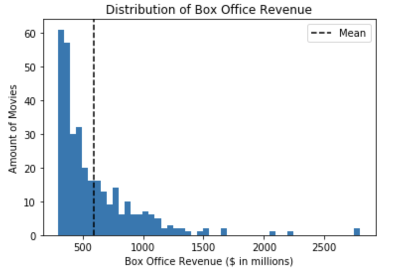
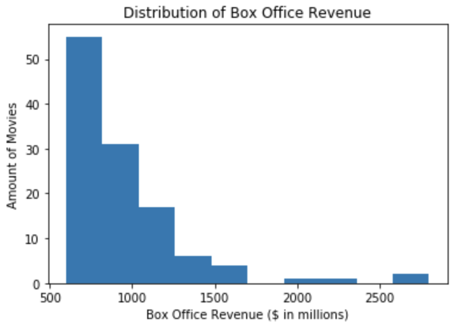
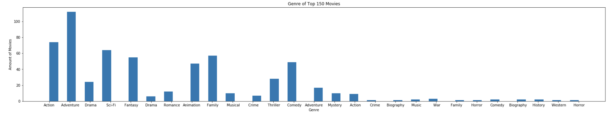
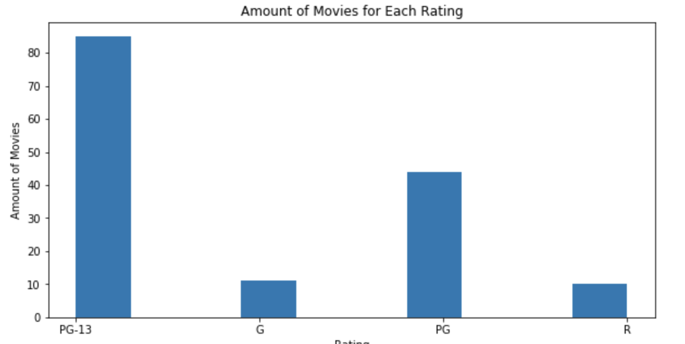
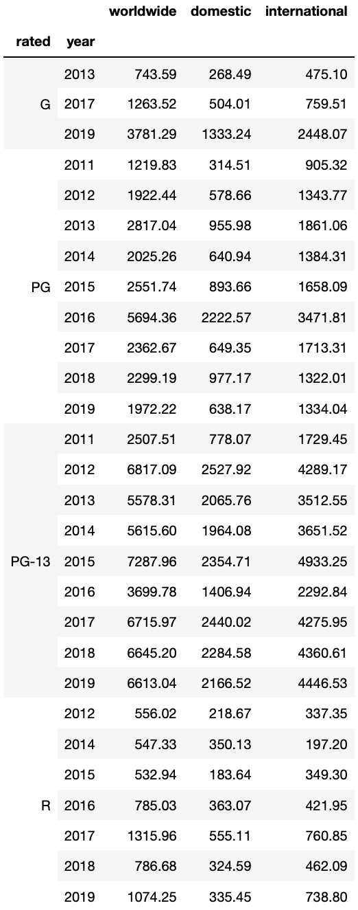

# Movie Data Analysis
## Gathering Data
In this project, data is gathered through scraping and taking advantage of the OMDB API. The code for the gathering of the data used in this project can be found in the gatherin_data.ipynb file of this repository. The gathering of the data is staright forward, scrape then use the data scrapped to make calls to the OMDB API to gather the rest of the data. BeautifulSoup4 was used as the technology of choice to scrape the HTML files from the website The Numbers. From this website, movie year, name, and box office revenue was gathered. This was made into a pandas dataframe, and the movie tittle was used to make calls to the OMDB API. The free version of the API only allows for 1,000 calls per day, so it is advisable that if you need more calls to upgrade to the paid version. However, for this project we only need 500 calls. Once we get the data from the API, it is appended into the dataframe and converted into a CSV file.

However, the API faces a couple of challenges. The data of the API can be innacurate, missing, or stored under a very specific name. Therfore, it can be difficult or impossible to find the appropriate data for each movie. Last, it does not always contain data for foreign movies.

## Data Cleaning
The process to clean the data is straight forward. Turn numbers that are in form of strings into floats, turn strings that are supposed to be list into list, and remove 'NaN' values using critics as a reference point. Critics does not have to be the reference point, it can be any of the other columns that can get rid of all 59 entries with missing data. Removing rows is the best option beacuse the data is specific to each movie, so it cannot be extrapolated from the rest of the dataset.

## Analysis
This analysis is seeking to answer the following questions:  
**What characteristics do movies that revenue average or better than average have?**  
1. What rating?  
2. What genre?  
3. What specific attributes can be observed in the top 10 movies?

To futher clean the data, the assumption that people will go watch a movie with higher ratings was made. Therfore, we are only looking at movies that have a 50% rating or higher. 

The analysis began by examining the revenue of the whole dataset. It can be observed that revenue decreases expotentially as it gets into the billions. The dotted line represents the mean of the data, which is about 595 million.  


The data was split into movies that perform average or better than average and movies that did not. 

  
  
To answer question number 2, a for loop was created that pull the data from the genre column into a single list with the following for loop.  

```python
g = []
for i in topDF.genre:
    g.extend(i)
```
The top 5 genres were:  
1. Adventure
2. Action
3. Sci-Fi
4. Family
5. Fantasy  

  
  
Now, the rating was very important. Most movies had a PG-13 rating, followed by a PG rating. 

  
  
However, the PG-13 rating was by far the most profitable. In 2019, PG-13 movies made more money than the other ratings combines for the same year. 

  
  
To observe specific attributes, the top 10 observations were taken. The following were interesting data found:  
1. 80% of movies were part of a series, sequel, or remakes.
2. 20% of movies had a higher rating than 90%.
3. Top 10 movies were not the top 10 best rated movies.
4. 90% of movies were less than 10 years old. 

**BONUS**
Top 10 rated movies were mostly kids movies except for Black Panther and Harry Potter: The Deathly Hollow.

## Conclusion
Movies that performed average or better had similar characteristics. Some were more relevant than others, such as a PG-13 rating. This makes sense because PG-13 captures a wider audience. Many of the top movies were part of a series showing that building loyalty leads to higher revenues in the future. Genre can make a difference, but a movie can be classified as multiple genres. However, action and adventure did separate from the rest, so it might be worth looking into writting movies in this genre. Further research into kids movie will be worth doing. Specifically, gathering data how much revenue the movies bring inderectly. For exmaple, collectible toys, cereals, and limited edition merchandise.
